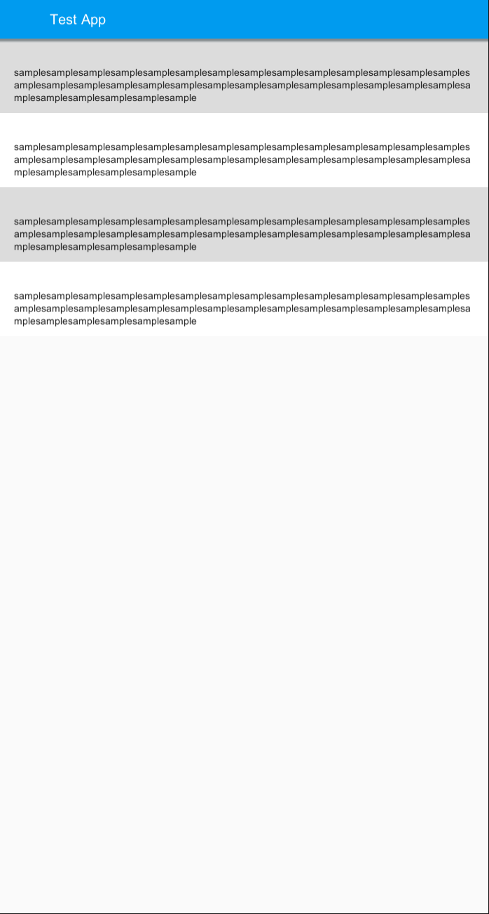

# UnityUIWidgetBugSample

## Setting
```
$ git clone https://github.com/DuGlaser/UnityUIWidgetBugSample.git
```
**You need to import the UIWidgets yourself.**

## Bug
1. Click the Game Play Button
2. Click the floatingButton of the HomeScreen (Assets/Scripts/HomeScreen.cs)
3. SecondScreen will be desplayed
4. The secondScreen may not be displayed correctly!(It doesn't happen every time.)

## nomalcy

## anomaly

